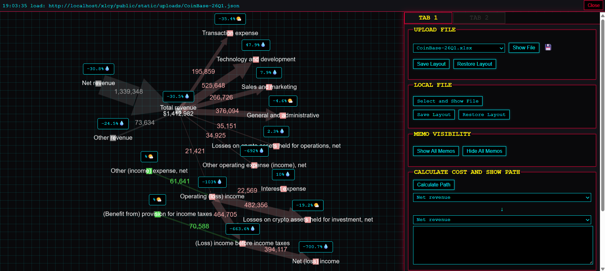
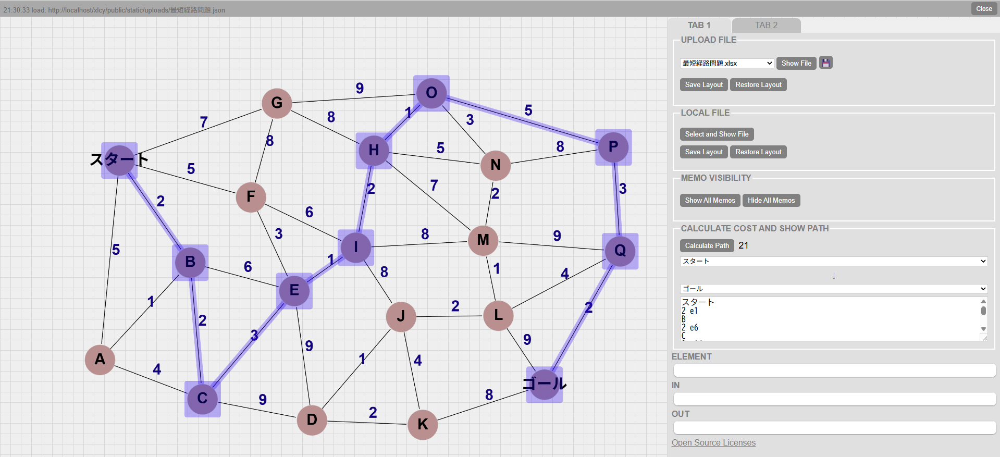

# xlcy
<p align="right">
  <strong>日本語</strong> | <a href="./README.md">English</a>
</p>

[](LICENSE)

`xlcy` は、Excel ワークブックを読み込んで Cytoscape.js のネットワークグラフとして表示する、ブラウザベースの可視化ツールです。

ノードとエッジを Excel の `node` / `edge` / `option` シートで定義し、ブラウザ上でグラフ表示、コメント表示、表示フィルタ、最短経路計算、配置 JSON の保存と復元を行います。サンプルとして、企業別の財務フローや最短経路問題の `.xlsx` / `.json` が `public/static/uploads/` に入っています。





## 公開先

XREA の Web サーバーで公開しています。

[http://pleasecov.g2.xrea.com/xlcy/public/index.php](http://pleasecov.g2.xrea.com/xlcy/public/index.php)

`public/` を PHP が動く Web サーバーで配信します。サーバー上で配置 JSON を保存する場合は、`public/static/uploads/` に Web サーバープロセスの書き込み権限が必要です。

## 主な機能

- Excel `.xlsx` / `.xlsm` からノード・エッジを読み込めます。
- Cytoscape.js + dagre による左から右への自動レイアウトを実行できます。
- Excel の `css.*` 列で、ノード・エッジ単位のスタイルを指定できます。
- `memo` 列の HTML 文字列を Tippy.js のコメントとして表示できます。
- Grid.js テーブルから、ノード、エッジ、モデル単位で表示と非表示を切り替えられます。
- Dijkstra 法で、表示中グラフの最短経路を計算できます。
- ローカル JSON ダウンロードで、配置を保存・復元できます。
- サーバー上の `static/uploads/` に配置 JSON を保存し、同名 Excel 読み込み時に自動復元できます。
- サードパーティライセンス一覧を生成できます。

## 画面構成

画面は、Excel 読み込み操作、Cytoscape.js のグラフ表示、サイドパネルの詳細・フィルタ表示で構成されています。

### Excel 読み込み

- `UPLOAD FILE` では、`public/static/uploads/` に置いた Excel をプルダウンで選び、`Show File` で読み込めます。
- `LOCAL FILE` では、`Select and Show File` から手元の Excel を選び、サーバーにアップロードせずにブラウザ内で読み込めます。
- アップロード済み Excel は、同名の配置 JSON があれば描画後に自動復元されます。

### グラフ操作

- ノードやエッジをクリックすると、サイドパネルに詳細と入出力エッジが表示されます。
- ノードはドラッグで配置を変更できます。
- 右クリックまたは 2 本指タップで、その要素のコメント表示を切り替えられます。
- `Show All Memos` / `Hide All Memos` で、全コメントをまとめて切り替えられます。
- `TAB 2` の `All Models` / `All Nodes` / `All Edges` で、表示対象を切り替えられます。
- `all on` / `all off` で、モデル単位の一括表示と非表示を実行できます。
- `Calculate Path` で、選択した始点から終点までの Dijkstra 最短経路を選択状態にし、経路とコストを表示できます。

### 配置保存

- アップロード済み Excel では、`Save Layout` で `public/static/uploads/<Excelファイル名>.json` に現在の Cytoscape 配置を保存します。
- ローカル Excel では、`Save Layout` で配置 JSON をダウンロードし、`Restore Layout` でその JSON を読み込みます。
- 復元時は、現在読み込んでいる Excel と保存 JSON の node / edge ID 差分を比較し、Excel 側を優先して差分を吸収します。

## データ

このアプリは、Excel の `node`、`edge`、`option` シートをブラウザ上で読み込み、Cytoscape.js 用の node / edge 配列に変換します。

| 項目 | 内容 |
| --- | --- |
| 入力ファイル | `.xlsx` / `.xlsm` |
| 必須シート | `node` / `edge` / `option` |
| グラフデータ | Excel の `node` / `edge` シート |
| 全体設定 | Excel の `option` シート |
| 配置保存ファイル | `public/static/uploads/<Excelファイル名>.json` |
| サンプル配置場所 | `public/static/uploads/` |
| 画像配置場所 | `public/static/image/` |

現行の `public/static/uploads/` には、企業別の財務フローや最短経路問題のサンプル Excel / JSON が含まれています。

注意点:

- `public/index.php` は `./index.php/static/uploads` への GET で `uploads` 内の Excel 一覧を返します。
- アップロード済み Excel のファイル名は UTF-8 として扱える必要があります。
- 追加列は基本的に Cytoscape 要素の `data` として保持されますが、画面上のテーブルは固定カラムで表示します。
- サンプルにある `_change` や `_emoji` はデータ側のメモ用途であり、現行 UI の専用機能ではありません。

## Excel フォーマット

現在の実装は `node`、`edge`、`option` の 3 シートを前提に読み込みます。シート名は半角小文字で作成してください。

`option` の値を使わない場合でも、`option` シートは作成しておくのが安全です。

### `node` シート

ノードを定義するシートです。1 行目をヘッダー、2 行目以降をデータにします。

| 列名 | 必須 | 説明 |
| --- | ---: | --- |
| `label` | 必須 | ノード ID と表示名になります。重複しない値にしてください。 |
| `parent` | 任意 | Cytoscape の compound node 用の親ノード ID です。 |
| `memo` | 任意 | コメントポップアップに表示する HTML 文字列です。 |
| `image` | 任意 | `public/static/image/` 内の画像ファイル名です。指定するとノード背景画像になり、ノードサイズは画像の実寸に合わせられます。 |
| `weight` | 任意 | 経路計算結果に加算するノードコストです。経路計算を使う場合は空欄にせず `0` 以上の数値を入れてください。 |
| `force_show_value` | 任意 | `true` の場合、このノードの値をラベルに表示します。 |
| `col` / `row` | 任意 | テーブル表示用のメタデータです。現在の描画処理では初期座標としては使っていません。 |
| `css.<property>` | 任意 | `css.` を外したプロパティ名で Cytoscape の style に渡します。 |

ノードの表示値は、描画後に接続エッジの `value` から再計算されます。流入エッジの合計があれば流入合計、流入合計が `0` の場合は流出エッジの合計が使われます。

サンプルでは次のような `css.*` 列を使っています。

```text
css.background-color
css.background-opacity
css.color
css.font-size
css.font-weight
css.height
css.shape
css.width
```

### `edge` シート

エッジを定義するシートです。1 行目をヘッダー、2 行目以降をデータにします。

| 列名 | 必須 | 説明 |
| --- | ---: | --- |
| `source` | 必須 | 接続元ノードの `label` です。 |
| `target` | 必須 | 接続先ノードの `label` です。 |
| `value` | 必須 | エッジの値です。線幅スケールと、`weight` 未指定時の経路計算コストに使われます。 |
| `label` | 任意 | エッジ上に表示するラベルです。 |
| `memo` | 任意 | コメントポップアップに表示する HTML 文字列です。 |
| `model` | 任意 | `TAB 2` のモデル単位フィルタで使うグループ名です。 |
| `weight` | 任意 | Dijkstra 計算で使うエッジコストです。未指定なら `value` が使われます。 |
| `curve-style` | 任意 | エッジの曲線スタイルです。読み込み後の初期値として使われます。 |
| `css.<property>` | 任意 | `css.` を外したプロパティ名で Cytoscape の style に渡します。 |

サンプルでは次のような `css.*` 列を使っています。

```text
css.color
css.font-size
css.font-weight
css.line-color
css.line-opacity
css.line-style
css.target-arrow-color
css.target-arrow-shape
css.text-margin-x
css.text-margin-y
css.text-opacity
css.width
```

### `option` シート

全体設定を 1 行で指定するシートです。1 行目をヘッダー、2 行目に値を書きます。

| 列名 | デフォルト | 説明 |
| --- | ---: | --- |
| `node_currency` | 空文字 | ノード値の前に付ける文字列です。 |
| `edge_currency` | 空文字 | エッジラベルの前に付ける文字列です。 |
| `node_unit` | 空文字 | ノード値の後ろに付ける文字列です。 |
| `edge_unit` | 空文字 | エッジラベルの後ろに付ける文字列です。 |
| `show_node_value` | `false` | `true` の場合、全ノードのラベルに値を表示します。 |
| `use_scale_width` | `false` | `true` の場合、エッジ `value` を対数スケールで 2px から 100px の幅に変換します。 |
| `use_directed` | `true` | `true` の場合、経路計算でエッジの向きを考慮します。 |
| `tippy_offset_x` | `0` | コメント表示位置の X オフセットです。 |
| `tippy_offset_y` | `15` | コメント表示位置の Y オフセットです。 |

サンプルファイルには `use_label_merge` や `avoid_overlap_padding` が含まれるものがありますが、現在の JavaScript では参照していません。

### 任意の追加列

`css.` で始まらない列は、基本的に Cytoscape 要素の `data` として保持されます。ただし、画面上のテーブルは固定カラムで表示しているため、追加列が自動的に UI に出るとは限りません。

## スタイル指定

`node` / `edge` シートの `css.<property>` 列は、`<property>` 部分だけを Cytoscape style として渡します。

例:

| Excel 列 | Cytoscape に渡る style |
| --- | --- |
| `css.background-color` | `background-color` |
| `css.font-size` | `font-size` |
| `css.line-color` | `line-color` |
| `css.target-arrow-shape` | `target-arrow-shape` |

利用できるプロパティの参考一覧は `docs/css-property.md` を参照してください。既定スタイルは `public/static/style/cy-style.json` にあります。

## 経路計算

経路計算は、現在表示中の要素だけを対象にします。非表示にしたノードやエッジは経路探索から外れます。

エッジの探索コストは `edge.weight`、未指定なら `edge.value` です。経路が決まった後、経路上のノードの `node.weight` が結果に加算されます。`node.weight` が空欄のノードを通ると結果が `NaN` になるため、経路計算用の Excel ではノードの `weight` に `0` 以上の数値を入れてください。

## 技術構成

| 用途 | 使用技術 |
| --- | --- |
| グラフ描画 | Cytoscape.js |
| 自動レイアウト | dagre / cytoscape-dagre |
| Excel 読み込み | SheetJS |
| コメント表示 | Tippy.js / Popper |
| テーブル表示 | Grid.js |
| DOM 操作、タブ切り替え | jQuery |
| 配列、オブジェクト処理 | lodash |
| 日付処理 | moment |
| 選択 UI | Grid.js RowSelection plugin |
| ファイル保存 | FileSaver.js |
| ルーティング、Excel 一覧取得、配置 JSON 保存 | PHP |
| メンテナンス用タスク | Node.js + gulp |

## ディレクトリ構成

```text
.
├── .github/
│   ├── image1.png
│   └── image2.png
├── docs/
│   ├── functions.md
│   ├── cheatsheet.md
│   ├── css-property.md
│   └── memo.txt
├── public/
│   ├── index.php
│   ├── index.html
│   ├── dist/
│   │   ├── bundle.js
│   │   └── LICENSE.txt
│   └── static/
│       ├── css/
│       ├── image/
│       ├── js/
│       ├── licenses/
│       ├── style/
│       └── uploads/
├── gulpfile.js
├── package.json
├── package-lock.json
├── run_Windows.bat
├── README.md
└── README_JA.md
```

主要ファイル:

- `public/index.php`: 軽量ルーターです。Excel 一覧取得、配置 JSON 保存、`index.html` 表示を担当します。
- `public/index.html`: アプリ本体の HTML です。各ライブラリを CDN 経由で読み込み、`public/dist/bundle.js` を読み込みます。
- `public/dist/bundle.js`: `public/static/js/` から生成される JavaScript バンドルです。
- `public/static/js/workbook-utils.js`: Excel シートを Cytoscape 用の node / edge 配列へ変換します。
- `public/static/js/entry.js`: グラフ描画、ファイル読み込み、配置保存・復元、経路計算を扱います。
- `public/static/js/gridjs-updater.js`: サイドパネルの Grid.js テーブルと表示切り替えを扱います。
- `public/static/js/tippy-attach.js`: `memo` からコメントポップアップを作成します。
- `public/static/js/server-fetch.js`: サーバー上の Excel 一覧取得と配置 JSON 保存を扱います。
- `public/static/js/cytoscape-gestures.js`: Cytoscape 要素の操作補助を扱います。
- `public/static/js/jqtab.js`: タブ切り替えを扱います。
- `public/static/style/cy-style.json`: Cytoscape の既定スタイルです。
- `public/static/uploads/`: アップロード済み Excel と、同名の配置 JSON を置く場所です。
- `gulpfile.js`: JavaScript バンドル生成とライセンス一覧生成の gulp タスクを定義します。

## セットアップ

通常利用に Node.js のビルドは不要です。`public/` を PHP が動く Web サーバーで配信できれば動きます。

必要環境:

- PHP 7.0 以上
- PHP `mbstring` 拡張
- `public/static/uploads/` に対する Web サーバープロセスの書き込み権限
- ES6 以降に対応したブラウザ
- Windows で使う場合は XAMPP 想定

`npm install` が必要なのは、`npm run build:js`、`npm run build:js-dev`、`npm run build:license` などのメンテナンス用タスクを実行する場合だけです。

```bash
npm install
```

## ローカル確認

リポジトリを XAMPP の `htdocs` 配下に置いている場合は、ブラウザで次を開きます。

```text
http://localhost/xlcy/public/
```

Windows では `run_Windows.bat` を実行すると、XAMPP コントロールパネルを開き、上記 URL をブラウザで開きます。

## メンテナンス

### JavaScript バンドルの再生成

`public/static/js/` の JavaScript を決められた順序で結合・圧縮し、`public/dist/bundle.js` を更新します。

```bash
npm run build:js
```

ソースマップ付きで生成する場合は、次を実行します。

```bash
npm run build:js-dev
```

### ライセンス一覧の再生成

`public/static/licenses/` 配下のライセンスファイルを結合し、`public/dist/LICENSE.txt` を更新します。

```bash
npm run build:license
```

結合順序は `gulpfile.js` で次のように定義されています。

```text
server-fetch.js
workbook-utils.js
gridjs-updater.js
tippy-attach.js
cytoscape-gestures.js
jqtab.js
entry.js
```

## トラブルシューティング

### Excel 一覧が表示されない

- `public/static/uploads/` に `.xlsx` または `.xlsm` があるか確認してください。
- PHP で `public/index.php` が実行される URL から開いてください。
- ファイル名が UTF-8 として扱えるか確認してください。

### レイアウト保存に失敗する

- `public/static/uploads/` に Web サーバープロセスの書き込み権限があるか確認してください。
- 同名 JSON を他プロセスで開いていないか確認してください。

### グラフ描画時にエラーになる

- `edge.source` / `edge.target` が `node.label` と完全一致しているか確認してください。
- `node.label` が重複していないか確認してください。
- `node`、`edge`、`option` のシート名が半角小文字になっているか確認してください。
- 空に見える不要な行や列に書式や値が残っていないか確認してください。

### 経路計算結果が `NaN` になる

経路上のノードに `weight` が入っていない可能性があります。経路計算を使う Excel では、すべてのノードに `weight` を数値で入れてください。

## ドキュメント

- `docs/functions.md`: JavaScript 関数の概要
- `docs/cheatsheet.md`: Cytoscape 操作用のメモ
- `docs/css-property.md`: Cytoscape style プロパティの参考一覧

## ライセンス

このリポジトリは MIT License です。サードパーティライブラリのライセンスは `public/dist/LICENSE.txt` にまとめています。
